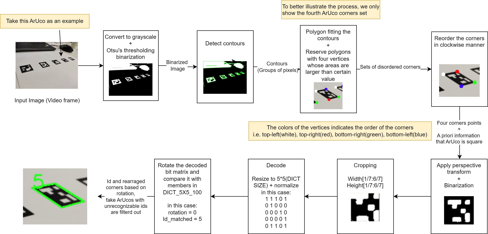

# Survey

ArUco, the name given to the fiducial marker system, has a rather straightforward origin. It is derived from the " **A**ugmented **R**eality library from the **U**niversity of **Co**rdoba." The system was developed by Rafael Muñoz-Salinas, a researcher at the University of Córdoba in Spain. ArUco markers have emerged as a powerful tool in computer vision, primarily due to their simplicity, robustness, and ease of use. These square fiducial markers are designed to be detected by cameras and can be used in various applications, from robotics and augmented reality to automotive systems and motion capture. The research around ArUco detection spans several domains, each contributing to the understanding and enhancement of this technology.

ArUco markers are utilized across a wide array of applications including robotics, augmented reality, automotive systems, underwater navigation, motion capture, and space missions. Their robustness, simplicity, and ease of implementation make them ideal for real-time detection and tracking tasks in diverse environments.

Several detection methods for ArUco markers have been developed, each with its own advantages and limitations. Traditional methods rely on simple computer vision techniques, such as thresholding and contour detection, to identify and decode the markers. These methods are highly efficient and can be executed in real-time, making them suitable for applications where computational resources are limited. However, they can struggle with occlusion and varying lighting conditions.

Advanced methods incorporate machine learning techniques to enhance detection accuracy. For instance, convolutional neural networks (CNNs) can be trained to recognize ArUco markers even under partial occlusion or in challenging lighting environments. These methods significantly improve detection robustness but at the cost of increased computational complexity and the need for more powerful hardware.

In this course project, we are supposed to use traditional methods instead of learning-based methods to implement our system. The strength of the traditional method is that it is straightforward and guaranteed in real-time, but it loses some robustness compared to the learning-based approach and does not have the ability to handle occlusion cases. Considering all the above issues, we plan to use thresholding and contour detection to detect the markers. Then, use perspective transformation to restore the pattern of the marker in the front view state and finally decode its bit sequence.

# Methodology

Detecting and decoding the ArUco markers can be summarized in the following steps:

1. **Preprocessing the Image**:
   The initial step involves converting the input image to grayscale to simplify further processing. This is followed by applying a binary threshold to the grayscale image, producing a binary image where the marker regions are highlighted against the background. The `cv2.threshold` function with the Otsu's method is used to automatically determine the optimal threshold value. The binary image is then inverted to ensure that the marker regions are white and the background is black. This preprocessing is critical for the good result of detecting contours.

2. **Detecting Contours**:
   The next step involves detecting contours in the binary image. Contours represent the boundaries of objects in the image. The `cv2.findContours` function is used to retrieve the contours, which are then processed to identify potential marker regions based on their geometric properties. Note that detecting contours is different from detecting the edges. Detecting contours involves grouping the edges’ pixels to form a closed region, while detecting edges does not identify the relationship among the edges’ pixels.

3. **Detecting Corners**:
   For each detected contour, the algorithm approximates the contour shape to a polygon and checks if it has four vertices (indicating a quadrilateral) because ArUco has four corners. Only quadrilaterals with a sufficient area are considered potential ArUco markers. In this step, we include most of the candidates for ArUco, while some of the wrong candidates, like square objects, are also included, which will be later filtered out.

4. **Ordering Points**:
   The detected corners of each marker are ordered in a consistent manner (e.g., top-left, top-right, bottom-right, bottom-left) to facilitate perspective transformation. This involves computing the centroid of the points and sorting them based on their angle relative to the centroid.

5. **Perspective Transformation**:
   The ordered corner points are used to compute a perspective transform matrix. This matrix is applied to the original image to obtain a top-down view of the marker, which is crucial for accurately decoding the marker's bit pattern.

6. **Decoding the Marker**:
   After obtaining the top-down view of the marker, we first cut off the edges pixels of the markers because the outermost pixels are all black, which is only used for ArUco detection while not carrying any information. Then, resize the marker image to $5\times 5$ (because the ArUco we used in this project is in the `DICT_5X5_100`, which means the information in the ArUco is stored in a $5\times 5$ matrix). The extracted bit pattern is compared against a predefined dictionary of marker patterns to determine the marker's ID. This involves checking for possible rotations of the bit pattern to ensure accurate identification. In this step, we filtered out the candidates whose decoded bit patterns (also with their rotated versions) do not match any of the members in the  `DICT_5X5_100`. Finally, our method also updates the correct order of the corners based on the rotation we made to decode the bit pattern, which can ensure a consistent orientation when displaying our “artwork in the gallery”.

The overall method can be summarized in Figure todo.



Among the above steps, reordering the points is really crucial because the wrong order of points can totally ruin the perspective transform result. I previously tried to determine the corner points using the following method:

**Top-Left Point**: This point has the smallest sum of its x and y coordinates because both x and y values are minimal at this corner.

**Bottom-Right Point**: This point has the largest sum of its x and y coordinates because both x and y values are maximal at this corner.

**Top-Right Point**: This point has the smallest difference between its x and y coordinates. Here, the x coordinate is large while the y coordinate is small, resulting in the smallest difference.

**Bottom-Left Point**: This point has the largest difference between its x and y coordinates. Here, the x coordinate is small while the y coordinate is large, resulting in the largest difference.

However, this method works well most of the time when we look essentially in a direction parallel to the ArUco’s normal. When the perspective distortion is significant, this method can fail and even repeat some of the points.

Knowing that we cannot use this method to determine the corners in the correct order all at once, we divide the process into two steps. First, reorder the point set in a clockwise manner, ignoring the real order of the corner points for an ArUco marker. Then, try to decode the ArUco markers in this initial order. If no match is found, rotate it by 90 degrees and repeat this up to three times. By doing so, we can confidently determine the correct point order to decode or verify whether it is a valid ArUco marker.

The overall logic behind can be described by the following algorithm, which takes in a image with a list of disorder corner points, and return a rearranged corner points with corresponding marker ids.

```python
Alorithm: Extract markers ids and orientation

Input: Image contatining ArUco markers (image), with a list of N disordered corners points (Corners: Shape[N,4,2])

Output: Markers ids, with corresponding ordered corners points [top-left (tl), top-right(tr), bottom-right(br), bottom-left(bl)]

Clockwise_Corners <- Reorder_Points_clk_wise(Corners)
marker_front_view <- Perspective_transform(Clockwise_corners)
marker_front_view_crop <- ratio_crop_out_most_pixel(marker_front_view)
marker_front_view_crop_bin <- binarize(marker_front_view_crop)
bit_matrix <- resize(marker_front_view_crop_binarize, 5X5) # resize to 5 pixels * 5 pixels to decode for markers in DICT_5X5_100
for i in range 0 to 3:
    bit_matrix <- rotate_clk_wise_degrees(bit_matrix, i * 90)
    if bit_matrix == certain_pattern_in_DICT:
		id  <- retrieve_id(certain_pattern_in_DICt)
        Rearranged_Corners <- roll(Clockwise_Corners, i) 
        return id, Rearranged_Corners
# If no matched id
 return -1, None

Function Reorder_Points_clk_wise(Corners):
   Center_Point

```


### References:

1. Real-Time Assessment of Rodent Engagement Using ArUco Markers. (2024). eNeuro. [Link](https://www.eneuro.org/content/11/3/ENEURO.0500-23.2024)
2. Automotive Perception System Evaluation with Reference Data from ArUco Markers. (2022). Springer. [Link](https://link.springer.com/article/10.1007/s11265-021-01734-3)
3. An Underwater Visual Navigation Method Based on Multiple ArUco Markers. (2021). MDPI. [Link](https://www.mdpi.com/2077-1312/9/12/1432)
4. The effects of ArUco marker velocity and size on motion capture. (2020). Sciendo. [Link](https://sciendo.com/article/10.37705/TechTrans/e2020036)
5. Pose determination of passively cooperative spacecraft in close proximity using ArUco markers. (2022). ScienceDirect. [Link](https://www.sciencedirect.com/science/article/abs/pii/S0094576522004283)
6. ArUco Marker Detection under Occlusion Using Convolutional Neural Networks. (2020). IEEE. [Link](https://ieeexplore.ieee.org/document/9230250/)

