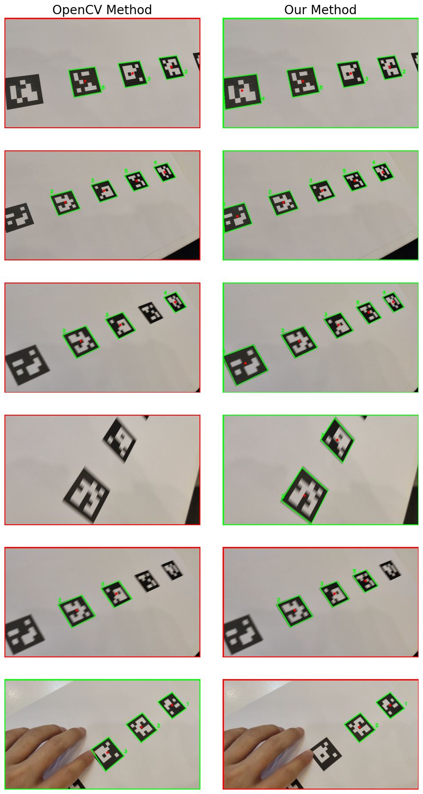

# Survey

ArUco, the name given to the fiducial marker system, has a rather straightforward origin. It is derived from the " **A**ugmented **R**eality library from the **U**niversity of **Co**rdoba." The system was developed by Rafael Muñoz-Salinas, a researcher at the University of Córdoba in Spain. ArUco markers have emerged as a powerful tool in computer vision, primarily due to their simplicity, robustness, and ease of use. These square fiducial markers are designed to be detected by cameras and can be used in various applications, from robotics and augmented reality to automotive systems and motion capture. The research around ArUco detection spans several domains, each contributing to the understanding and enhancement of this technology.

ArUco markers are utilized across a wide array of applications including robotics, augmented reality, automotive systems, underwater navigation, motion capture, and space missions. Their robustness, simplicity, and ease of implementation make them ideal for real-time detection and tracking tasks in diverse environments.

Several detection methods for ArUco markers have been developed, each with its own advantages and limitations. Traditional methods rely on simple computer vision techniques, such as thresholding and contour detection, to identify and decode the markers. These methods are highly efficient and can be executed in real-time, making them suitable for applications where computational resources are limited. However, they can struggle with occlusion and varying lighting conditions.

Advanced methods incorporate machine learning techniques to enhance detection accuracy. For instance, convolutional neural networks (CNNs) can be trained to recognize ArUco markers even under partial occlusion or in challenging lighting environments. These methods significantly improve detection robustness but at the cost of increased computational complexity and the need for more powerful hardware.

In this course project, we are supposed to use traditional methods instead of learning-based methods to implement our system. The strength of the traditional method is that it is straightforward and guaranteed in real-time, but it loses some robustness compared to the learning-based approach and does not have the ability to handle occlusion cases. Considering all the above issues, we plan to use thresholding and contour detection to detect the markers. Then, use perspective transformation to restore the pattern of the marker in the front view state and finally decode its bit sequence.

# Methodology

Detecting and decoding the ArUco markers can be summarized in the following steps:

1. **Preprocessing the Image**:
   The initial step involves converting the input image to grayscale to simplify further processing. This is followed by applying a binary threshold to the grayscale image, producing a binary image where the marker regions are highlighted against the background. The `cv2.threshold` function with the Otsu's method is used to automatically determine the optimal threshold value. The binary image is then inverted to ensure that the marker regions are white and the background is black. This preprocessing is critical for the good result of detecting contours.

2. **Detecting Contours**:
   The next step involves detecting contours in the binary image. Contours represent the boundaries of objects in the image. The `cv2.findContours` function is used to retrieve the contours, which are then processed to identify potential marker regions based on their geometric properties. Note that detecting contours is different from detecting the edges. Detecting contours involves grouping the edges’ pixels to form a closed region, while detecting edges does not identify the relationship among the edges’ pixels.

3. **Detecting Corners**:
   For each detected contour, the algorithm approximates the contour shape to a polygon and checks if it has four vertices (indicating a quadrilateral) because ArUco has four corners. Only quadrilaterals with a sufficient area are considered potential ArUco markers. In this step, we include most of the candidates for ArUco, while some of the wrong candidates, like square objects, are also included, which will be later filtered out.

4. **Ordering Points**:
   The detected corners of each marker are ordered in a consistent manner (e.g., top-left, top-right, bottom-right, bottom-left) to facilitate perspective transformation. This involves computing the centroid of the points and sorting them based on their angle relative to the centroid.

5. **Perspective Transformation**:
   The ordered corner points are used to compute a perspective transform matrix. This matrix is applied to the original image to obtain a top-down view of the marker, which is crucial for accurately decoding the marker's bit pattern.

6. **Decoding the Marker**:
   After obtaining the top-down view of the marker, we first cut off the edges pixels of the markers because the outermost pixels are all black, which is only used for ArUco detection while not carrying any information. Then, resize the marker image to $5\times 5$ (because the ArUco we used in this project is in the `DICT_5X5_100`, which means the information in the ArUco is stored in a $5\times 5$ matrix). The extracted bit pattern is compared against a predefined dictionary of marker patterns to determine the marker's ID. This involves checking for possible rotations of the bit pattern to ensure accurate identification. In this step, we filtered out the candidates whose decoded bit patterns (also with their rotated versions) do not match any of the members in the  `DICT_5X5_100`. Finally, our method also updates the correct order of the corners based on the rotation we made to decode the bit pattern, which can ensure a consistent orientation when displaying our “artwork in the gallery”.

The overall method can be summarized in Figure todo.


Among the above steps, reordering the points is really crucial because the wrong order of points can totally ruin the perspective transform result. I previously tried to determine the corner points using the following method:

**Top-Left Point**: This point has the smallest sum of its x and y coordinates because both x and y values are minimal at this corner.

**Bottom-Right Point**: This point has the largest sum of its x and y coordinates because both x and y values are maximal at this corner.

**Top-Right Point**: This point has the smallest difference between its x and y coordinates. Here, the x coordinate is large while the y coordinate is small, resulting in the smallest difference.

**Bottom-Left Point**: This point has the largest difference between its x and y coordinates. Here, the x coordinate is small while the y coordinate is large, resulting in the largest difference.

However, this method works well most of the time when we look essentially in a direction parallel to the ArUco’s normal. When the perspective distortion is significant, this method can fail and even repeat some of the points.

Knowing that we cannot use this method to determine the corners in the correct order all at once, we divide the process into two steps. First, reorder the point set in a clockwise manner, ignoring the real order of the corner points for an ArUco marker. Then, try to decode the ArUco markers in this initial order. If no match is found, rotate it by 90 degrees and repeat this up to three times. By doing so, we can confidently determine the correct point order to decode or verify whether it is a valid ArUco marker.

The overall logic behind can be described by the following algorithm, which takes in a image with a list of disorder corner points, and return a rearranged corner points with corresponding marker ids.

```python
Alorithm: Extract markers ids and orientation

Input: Image contatining ArUco markers (image), with a list of N disordered corners points (Corners: Shape[N,4,2])

Output: Markers ids, with corresponding ordered corners points [top-left (tl), top-right(tr), bottom-right(br), bottom-left(bl)]

Clockwise_Corners <- Reorder_Points_clk_wise(Corners)
marker_front_view <- Perspective_transform(Clockwise_corners)
marker_front_view_crop <- ratio_crop_out_most_pixel(marker_front_view)
marker_front_view_crop_bin <- binarize(marker_front_view_crop)
bit_matrix <- resize(marker_front_view_crop_binarize, 5X5) # resize to 5 pixels * 5 pixels to decode for markers in DICT_5X5_100
for i in range 0 to 3:
    bit_matrix <- rotate_clk_wise_degrees(bit_matrix, i * 90)
    if bit_matrix == certain_pattern_in_DICT:
		id  <- retrieve_id(certain_pattern_in_DICt)
        Rearranged_Corners <- roll(Clockwise_Corners, i) 
        return id, Rearranged_Corners
# If no matched id
 return -1, None

Function Reorder_Points_clk_wise(Corners):
   Center_Point <- (Corners[0]+Corners[1]+Corners[2]+Corners[3])/4
	# Calculate the angle between the line connecting the corner point and the center point and the horizontal line
    Corner_angles <- arctan(Corners-Center_Point)
    sorted_indices <- sort(Corner_angles)
    sorted_corners <- Corners[sorted_indices]
    return sorted_corners
end Function

```

```
Algorithm: Extract markers IDs and orientation

Input: 
    - Image containing ArUco markers (image)
    - List of N disordered corner points (Corners: Shape[N, 4, 2])

Output: 
    - Markers IDs, with corresponding ordered corners points [top-left (tl), top-right (tr), bottom-right (br), bottom-left (bl)]

Main Function:
1. Clockwise_Corners <- Reorder_Points_Clockwise(Corners)
2. Marker_Front_View <- Perspective_Transform(Clockwise_Corners)
3. Marker_Front_View_Crop <- Ratio_Crop_Out_Most_Pixel(Marker_Front_View)
4. Marker_Front_View_Crop_Bin <- Binarize(Marker_Front_View_Crop)
5. Bit_Matrix <- Resize(Marker_Front_View_Crop_Bin, 5x5)  # Resize to 5x5 pixels to decode markers in DICT_5X5_100
6. For i in range 0 to 3:
       a. Bit_Matrix <- Rotate_Clockwise_Degrees(Bit_Matrix, i * 90)
       b. If Bit_Matrix matches a certain pattern in DICT:
            i. ID <- Retrieve_ID(certain_pattern_in_DICT)
           ii. Rearranged_Corners <- Roll(Clockwise_Corners, i)
          iii. Return ID, Rearranged_Corners
7. Return -1, None  # If no matched ID

Function Reorder_Points_Clockwise(Corners):
    - Center_Point <- (Corners[0] + Corners[1] + Corners[2] + Corners[3]) / 4
    - Corner_Angles <- arctan2(Corners - Center_Point)  # Calculate angles between corner points and center point
    - Sorted_Indices <- argsort(Corner_Angles)
    - Sorted_Corners <- Corners[Sorted_Indices]
    - Return Sorted_Corners
End Function

```

```latex
\begin{algorithm}[H]
\caption{Extract Markers IDs and Orientation}
\begin{algorithmic}[0]
    \Require Image containing ArUco markers (\textit{image}), List of $N$ disordered corner points (\textit{Corners}: Shape[$N$, 4, 2])
    \Ensure Markers IDs, ordered corners points
    
    \State \text{\# Reorder points in clock wise order}
    \State $Corners \gets \text{make\_clk\_wise}(Corners)$
    \State \text{\# Do Perspective Transform}
    \State $Marker \gets \text{Persp\_trans}(Corners)$
    \State $Crop \gets \text{Ratio\_crop}(Marker)$
    \State $Bin \gets \text{Binarize}(Crop)$
    \State \text{\# Resize to 5x5 pixels to decode markers in DICT\_5X5\_100}
    \State $Bit \gets \text{Resize}(Bin, 5 \times 5)$ 
    \For{$i \gets 0 \text{ to } 3$}
        \State \text{\# Rotate decoded bit sequence clock wise}
        \State $Bit \gets \text{rot}(Bit, -i \times 90)$
        \If{$Bit\_Matrix = certain_pattern_in_DICT$}
            \State $ID \gets \text{Retrieve\_ID}(certain\_pattern\_in\_DICT)$
            \State \text{\# Roll down the corners according to i}
            \State $Corners \gets \text{Roll}(Corners, i)$
            \State \Return $ID, Rearranged\_Corners$
        \EndIf
    \EndFor
    \State \Return $-1, \text{None} \text{   \# If no matched ID}$

    \Function{make\_clk\_wise}{Corners}
        \State $center \gets \text{get\_center}(Corners)$
        \State $angles \gets \text{arctan}(Corners - center)$
        \State $Indices \gets \text{sort}(angles)$
        \State $Corners \gets \text{Corners}[Indices]$
        \State \Return $Corners$
    \EndFunction
\end{algorithmic}
\end{algorithm}
```

The corresponding python code is

```python
# make_clk_wise
def order_points(pts):
    center = np.mean(pts, axis=0)
    angles = np.arctan2(pts[:, 1] - center[1], pts[:, 0] - center[0])
    sorted_indices = np.argsort(angles)
    sorted_pts = pts[sorted_indices]
    sorted_pts = sorted_pts.astype(np.float32)
    return sorted_pts

# Extract Markers IDs and Orientation
def extract_marker_id(corner_points, image):
    ordered_corners = order_points(corner_points.reshape(4, 2))
    ordered_corners_np = np.array(ordered_corners, dtype=np.int32)
    (tl, tr, br, bl) = ordered_corners

    widthA = np.sqrt(((br[0] - bl[0]) ** 2) + ((br[1] - bl[1]) ** 2))
    widthB = np.sqrt(((tr[0] - tl[0]) ** 2) + ((tr[1] - tl[1]) ** 2))
    maxWidth = max(int(widthA), int(widthB))

    heightA = np.sqrt(((tr[0] - br[0]) ** 2) + ((tr[1] - br[1]) ** 2))
    heightB = np.sqrt(((tl[0] - bl[0]) ** 2) + ((tl[1] - bl[1]) ** 2))
    maxHeight = max(int(heightA), int(heightB))
    
    maxLength = max(maxWidth, maxHeight)

    dst = np.array([
        [0, 0],
        [maxLength - 1, 0],
        [maxLength - 1, maxLength - 1],
        [0,  maxLength- 1]], dtype="float32")

    M = cv2.getPerspectiveTransform(ordered_corners, dst)
    warped = cv2.warpPerspective(image, M, (maxLength,maxLength))
    warped_gray = cv2.cvtColor(warped, cv2.COLOR_BGR2GRAY)
    _, warped_binary = cv2.threshold(warped_gray, 127, 255, cv2.THRESH_BINARY | cv2.THRESH_OTSU)
    warped_binary = warped_binary[int(maxLength/7):int(maxLength/7*6),int(maxLength/7):int(maxLength/7*6)]
    aruco_binary = cv2.resize(warped_binary, (5, 5)) # for DICT_5X5
    aruco_binary = (aruco_binary > 0).astype(int)
    marker_id, aruco_binary_rot, rot = find_matching_aruco(aruco_binary)
    reagrranged_corners = ordered_corners_np
    if not marker_id == -1:
        reagrranged_corners = np.roll(ordered_corners_np, rot, axis=0)
    return marker_id, reagrranged_corners

def find_matching_aruco(aruco_binary):
    for rotation in range(4):
        for key, value in ARUCO_DICT.items():
            if np.array_equal(aruco_binary, value):
                return key, aruco_binary, rotation
        aruco_binary = np.rot90(aruco_binary, -1)
    return -1, aruco_binary, None
```


# Results

Because ArUco detection is not end-to-end and proceeds step-by-step, the number of operations in later stages is limited by the number of candidate polygons in the image. This number varies greatly from image to image, making it difficult to estimate the time and space complexity directly. In other words, if there are many polygonal objects (including ArUco markers) in the image, it will take more time to determine if each object is a legitimate ArUco marker. If we define the number of candidate polygons as N, and assume each candidate polygon is a quadrilateral, we can infer that computation and storage grow linearly with the number of polygons. Thus, the time and space complexity can be expressed as O(N). However, the complexities of detecting contours and fitting polygons using OpenCV library functions are unknown to us, though they are positively correlated with the number of pixels.

Despite this, we can estimate the performance of our own implementation of the ArUco detection algorithm. Our baseline method is the ArUco library in OpenCV, which is optimized at the algorithmic level, the C++ interface, and even directly from the CPU hardware level. Initially, we did not expect to surpass the performance of the OpenCV ArUco library. However, after conducting experiments, we found that our method outperformed the OpenCV ArUco library in some cases.

The experiment setup was as follows:
1. First experiment: Input the same video stream (387 frames in total) to both the baseline method and our method (the ArUco markers in the video have been panned, side-viewed, etc.), decode the ArUco markers, and compare the average FPS at different resolutions.
2. Second experiment: Fix the resolution (640x360) of the video stream, and check whether the number of ArUco markers detected by our method and the OpenCV detection method is the same on each frame. These experiments were conducted on my personal laptop with an Intel Core i7-12700H CPU. The GPU was not used to accelerate detection.

| Resolution | OpenCV’s FPS (frames per second) | Ours FPS (frames per second) |
| ---------- | -------------------------------- | ---------------------------- |
| 640x360    | 739.76                           | 722.79                       |
| 1080x607   | 398.37                           | 378.25                       |
| 1920x1080  | 140.36                           | 140.35                       |
| 2560x1440  | 87.62                            | 101.80                       |
| 4096x2304  | 38.80                            | 55.76                        |

According to Table todo, our method and the OpenCV library function have comparable frame rates for smaller images (with only a 2% difference). As the image size increases, the frame rate of our method decreases less significantly than that of the OpenCV library function. For images larger than 1920x1440, our method can even achieves a performance improvement of 43.7% over the OpenCV library function, as seen with 4096x2304 resolution.

In the second experiment, regarding detection accuracy, our method consistently outperformed OpenCV's in most cases. Out of 387 video frames, our method produced different results in 52 frames compared to OpenCV. In 42 of these 52 frames, our method detected more ArUco markers than OpenCV's method (all detected ArUco markers were correct). In only 10 consecutive frames did our method fail to detect more ArUco markers than OpenCV. Typical results are shown in Figure todo.



From the first two lines of Figure todo, our method performs better at detecting the edges of ArUco markers that are partially out of the field of view. From the third to fifth rows, it is evident that our method handles dynamic blurring better than OpenCV's method. However, in the last case, where the ArUco marker is partially occluded by an irregular object (e.g., a finger), OpenCV's method is more robust.

Regarding frame rate, since we don't know the details of OpenCV's internal implementation, we can't determine why our approach achieves higher frame rates than the OpenCV ArUco library when the image size increases. However, it's reasonable to assume that our simple and efficient detection and decoding approach allows us to achieve very high frame rates, even without C++ acceleration or hardware acceleration, unlike OpenCV.

Regarding recognition accuracy, our final code crops only 1/8 of the edges of the perspective-transformed ArUco markers instead of 1/7 as initially planned. This adjustment improves the recognition of ArUco markers farther from the lens center, as the edges are more affected by the camera's aberration. After perspective transformation, the black edges of the ArUco markers often become narrower, and reduced cropping ensures that useful information pixels are not lost. Additionally, performing Otsu binarization before decoding the ArUco markers helps handle residual shadows from motion blur, as Otsu binarization selects the threshold that minimizes variance. In cases where the ArUco marker edges are occluded by irregular objects, our method may fail because irregular object edges create new polygon corner points. When we detect a polygon with more or fewer than four corner points, we discard it as a candidate, leading to a failure in these cases.

### References:

1. Real-Time Assessment of Rodent Engagement Using ArUco Markers. (2024). eNeuro. [Link](https://www.eneuro.org/content/11/3/ENEURO.0500-23.2024)
2. Automotive Perception System Evaluation with Reference Data from ArUco Markers. (2022). Springer. [Link](https://link.springer.com/article/10.1007/s11265-021-01734-3)
3. An Underwater Visual Navigation Method Based on Multiple ArUco Markers. (2021). MDPI. [Link](https://www.mdpi.com/2077-1312/9/12/1432)
4. The effects of ArUco marker velocity and size on motion capture. (2020). Sciendo. [Link](https://sciendo.com/article/10.37705/TechTrans/e2020036)
5. Pose determination of passively cooperative spacecraft in close proximity using ArUco markers. (2022). ScienceDirect. [Link](https://www.sciencedirect.com/science/article/abs/pii/S0094576522004283)
6. ArUco Marker Detection under Occlusion Using Convolutional Neural Networks. (2020). IEEE. [Link](https://ieeexplore.ieee.org/document/9230250/)

